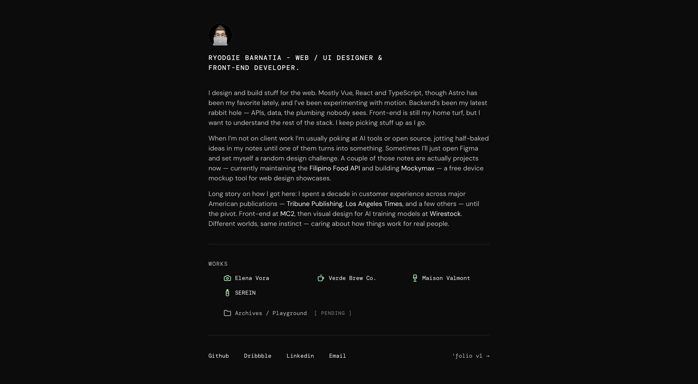

# ryodgie.com

Personal portfolio of Ryodgie Barnatia. Web/UI designer and front-end developer.

[](https://ryodgie.com)

→ [ryodgie.com](https://ryodgie.com)

## Stack

- [Astro 5](https://astro.build) — static site framework
- SCSS with design tokens
- DM Sans + DM Mono (self-hosted via `@fontsource`)
- Vanilla TypeScript for interactivity
- Deployed on [Vercel](https://vercel.com)

## Develop locally

```bash
npm install
npm run dev
```

Open \`localhost:4321\`.

## Commands

| Command           | Action                               |
| :---------------- | :----------------------------------- |
| `npm install`     | Install dependencies                 |
| `npm run dev`     | Start local dev server               |
| `npm run build`   | Build to `./dist/`                   |
| `npm run preview` | Preview the production build locally |

## Structure

```text
src/
├── content/
│   ├── about/       — bio (markdown)
│   └── works/       — project entries (markdown + images)
├── components/      — UI components
├── data/seo.ts      — site metadata, page titles, structured data
├── layouts/         — page shell
├── pages/           — routes (landing + dynamic /works/[slug])
└── styles/
    └── tokens.scss  — colors, spacing, motion
```

## License

© 2026 Ryodgie Barnatia. All rights reserved.
